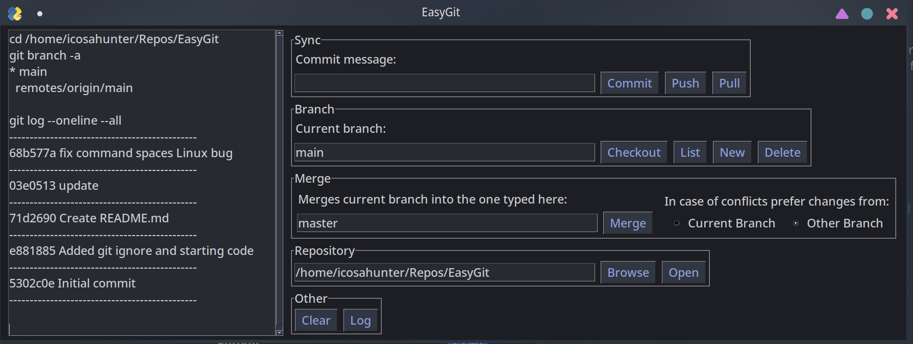

# EasyGit
Simplified Git GUI for beginners.
EasyGit gives you easy access to the very the basics required to
use a git repository.

# Features
 - Sync: Commit, push, and pull
 - Branches: checkout, new, delete, list
 - Merge: Choose merge branch, choose merge strategy (theirs/ours)
 - Repository: Open repository
 - Other: Show commit log, clear console
 
Any features not present in the GUI can be accessed
by entering commands in the console box.
